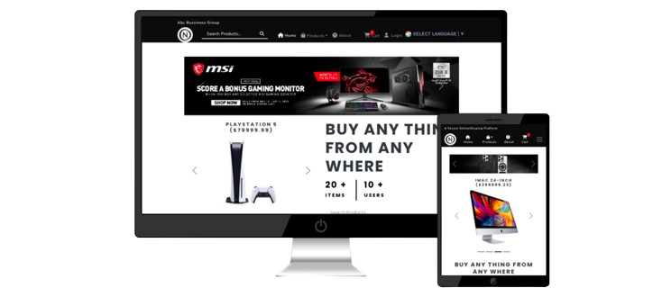

# NobaShop - Fully Integrated Ecommerce Website

Welcome to NobaShop, your one-stop destination for a seamless online shopping experience! NobaShop is a fully integrated ecommerce website that incorporates all the standard functionalities of a modern ecommerce platform, along with a secure payment system using Chapa.

### Explore the live demo of NobaShop: [NobaShop Live Demo](https://nobashop.vercel.app)


## Project Overview

NobaShop is designed to provide users with a comprehensive and user-friendly ecommerce platform. Whether you are a shopper looking for a variety of products or a business owner wanting to sell your products online, NobaShop has got you covered.

## Key Features

1. **User Authentication and Authorization:**
   - Secure user registration and login functionality.
   - User roles for customers, sellers, and administrators.

2. **Product Management:**
   - Easy addition, editing, and removal of products.
   - Categorization and filtering for a streamlined shopping experience.

3. **Shopping Cart:**
   - Add products to the cart for a convenient shopping experience.
   - Adjust quantities and remove items from the cart.

4. **Checkout Process:**
   - Smooth and intuitive checkout process.
   - Address management for shipping.

5. **Order Management:**
   - View order history and details.
   - Track order status.
   - pre Order functionality
   - back order functionalities

6. **Payment Integration:**
   - Fully integrated Chapa payment system for secure and seamless transactions.
   - Support for various payment methods, including credit cards and mobile payments.

7. **User Reviews and Ratings:**
   - Customers can leave reviews and ratings for products.

8. **Responsive Design:**
   - Ensures a seamless experience across various devices.

9. **Admin Dashboard:**
   - Admin panel for managing products, orders, and users.
   - Real-time analytics and reporting.
9. **additional features:**
   - translation with multiple languages.
   - Resposnive Design seamless seamless experience.
  

The platform is built using the following technologies:

- React
- Redux
- Django
- MySQL
- Vite project

## Benefits

## Getting Started

To get started with the Faayaa Ecommerce Platform, you can follow these steps:


## Setup the BackEnd


1. Clone the GitHub repository:

```
git clone https://github.com/Noble-ch/onlineShop

```
2. Change directory to the respository
```
cd onlineShop
```
3. Install backend dependencies(you can skip step 4 , 5 ,6 , 7) if you use this step
```
pip install requirements.tx
```
4. Install backend dependencies(Windows):
  
```
pip install pipenv
```
5. Install backend dependencies(Ubuntu):
  
```
sudo apt install pipenv
```
6. Install backend dependencies Part-Two:
  
```
pipenv install
```

7. Activate the virtual environment only if you use pipenv
```
pipenv shell
```
8. collect static
```
python manage.py collectstatic   
```
9. Start the Server
```
python manage.py runserver  //change debug to true in settings.py if it doesn't open the homepage
```


## Setup the FrontEnd

1. Change directory

```
cd frontend/
```
2. Install dependencies

```
npm install
```

3. Start the frontend server:

```
npm rundev
```

4. Open your web browser and navigate to `http://localhost:5175`

## Contributing

We welcome contributions to the Faayaa Ecommerce Platform. To contribute, please fork the repository and create a pull request.

